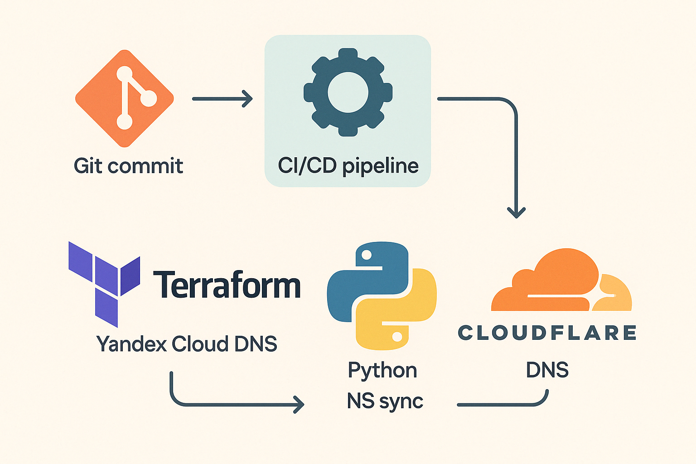
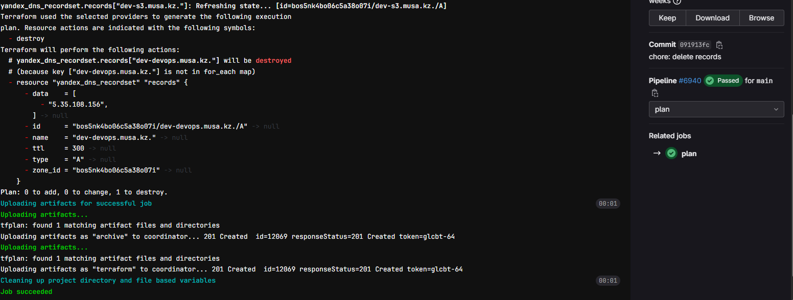
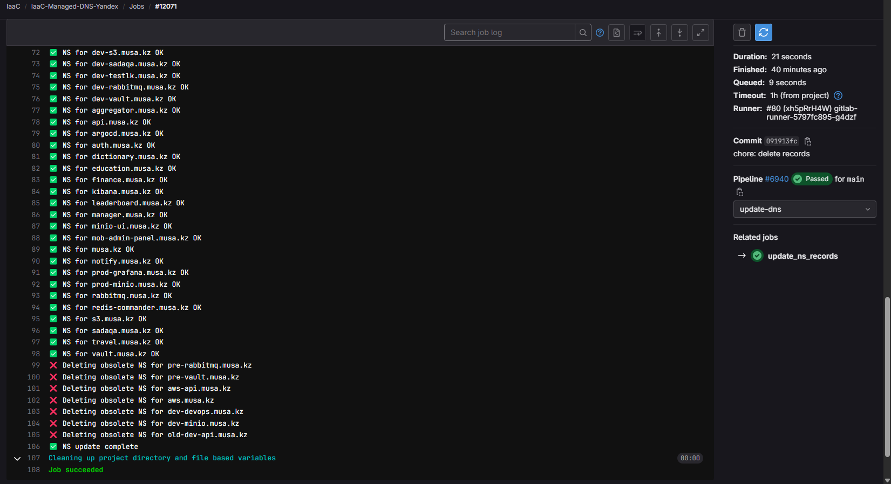

# 🌐 Automated DNS Management for **musa.kz**

A complete infrastructure‑as‑code solution combining **Yandex Cloud DNS** (Terraform) and **Cloudflare NS** synchronization (Python), orchestrated via **GitLab CI/CD** or **GitHub Actions**.

---

## 📖 Overview

1. **Terraform** provisions and manages Yandex Cloud DNS zones and A/CNAME records.
2. **Python Script** synchronizes NS delegation in Cloudflare:
   - Creates new NS records
   - Updates existing NS if value changes
   - Converts A → NS when needed
   - Deletes obsolete NS entries
3. **CI/CD** automates the pipeline:
   `validate → plan → apply (manual) → update‑dns`.



---

## 📚 Official Documentation

- **Terraform Yandex Provider**: https://registry.terraform.io/providers/yandex-cloud/yandex/latest
- **Yandex IAM Service Accounts**: https://cloud.yandex.com/docs/iam/operations/sa/create
- **Cloudflare API**: https://api.cloudflare.com/
- **GitLab Terraform State**: https://docs.gitlab.com/ee/user/infrastructure/terraform_state/

## 🛠️ Prerequisites

### 1. Yandex Cloud Service Account for Terraform

1. **Create a service account** in Yandex Cloud Console:  
   - Navigate to **IAM & Admin → Service accounts → Create service account**.  
   - Assign roles: `dns.editor` and `folderViewer` (or higher).  
2. **Download JSON key** and store as `YC_KEY_JSON` secret in CI.
3. **Terraform Yandex Provider**:  
   ```hcl
   provider "yandex" {
     service_account_key_file = var.yc_key_json
     cloud_id                 = var.yc_cloud_id
     folder_id                = var.yc_folder_id
     zone                      = var.domain
   }
   ```
   See [Terraform Yandex Provider Docs](https://registry.terraform.io/providers/yandex-cloud/yandex/latest/docs).

### 2. Cloudflare API Token

1. Log in to Cloudflare Dashboard.  
2. **My Profile → API Tokens → Create Token**.  
3. Use **DNS Editor** template, scope to your zone.  
4. Save token as `CLOUDFLARE_API_TOKEN` and zone ID as `ZONE_ID` in CI.

### 3. GitLab HTTP Backend for Terraform State

Store your Terraform state in GitLab:  
```hcl
terraform {
  backend "http" {
    address        = var.tf_backend_address
    lock_address   = var.tf_backend_lock_address
    unlock_address = var.tf_backend_lock_address
    username       = var.tf_backend_user
    password       = var.gitlab_access_token
    lock_method    = "POST"
    unlock_method  = "DELETE"
    retry_wait_min = 5
  }
}
```
Configure `TF_BACKEND_ADDRESS`, `TF_BACKEND_LOCK_ADDRESS`, `TF_BACKEND_USER`, and `GITLAB_ACCESS_TOKEN` via CI variables.

---

## 📂 Repository Structure

```
├── main.tf                  # Terraform resources for Yandex DNS
├── variables.tf             # Input variables (no defaults)
├── records.example.yaml     # Template with placeholders
├── records.yaml             # Ignored; populated by CI
├── update_ns_records.py     # Python NS sync script
├── .gitlab-ci.yml           # GitLab CI pipeline definition
├── .github/workflows/       # GitHub Actions pipelines (optional)
├── docs/
│   ├── architecture.png     # Architecture diagram
│   └── screenshots/
│       ├── plan.png         # Terraform plan screenshot placeholder
│       └── ns-sync.png      # NS sync log screenshot placeholder
└── terraform.rc             # Provider mirror config
``` 

---

## 🛳️ Building the Custom Terraform Docker Image

We use a custom Docker image to ensure all Terraform providers and Yandex Cloud plugins are pre‑installed. Follow these steps:

1. **Create a Dockerfile** named `Dockerfile.terraform` in the repo root:
   ```dockerfile
   # Dockerfile.terraform
   FROM hashicorp/terraform:1.5.0

   # Install Yandex Cloud provider plugin and necessary tools
   RUN mkdir -p /terraform/plugins && \
       curl -sSL "https://github.com/yandex-cloud/terraform-provider-yandex/releases/download/v0.83.0/terraform-provider-yandex_0.83.0_linux_amd64.tar.gz" \
         | tar -xz -C /terraform/plugins && \
       apk add --no-cache bash jq

   # Point Terraform to plugin directory
   ENV TF_PLUGIN_CACHE_DIR=/terraform/plugins

   ENTRYPOINT ["terraform"]
   ```

2. **Build the image** locally:
   ```bash
   docker build -f Dockerfile.terraform \
     -t cr.yandexcloud.kz/crk6d6loj06cdtbpo5qf/terraform-yandex:latest .
   ```

3. **Push to your registry**:
   ```bash
   docker push cr.yandexcloud.kz/crk6d6loj06cdtbpo5qf/terraform-yandex:latest
   ```

4. **Verify** by running:
   ```bash
   docker run --rm cr.yandexcloud.kz/crk6d6loj06cdtbpo5qf/terraform-yandex:latest version
   ```

---

## ⚙️ CI/CD Setup

### Required CI Variables (GitLab or GitHub Secrets)

| Name                     | Description                                         |
|--------------------------|-----------------------------------------------------|
| `YC_KEY_JSON`            | Yandex service account JSON                         |
| `YC_CLOUD_ID`            | Yandex Cloud ID                                     |
| `YC_FOLDER_ID`           | Yandex Folder ID                                    |
| `DOMAIN`                 | Root domain (e.g. `musa.kz`)                        |
| `ZONE_NAME`              | Yandex DNS zone name                                |
| `GITLAB_ACCESS_TOKEN`    | Token for Terraform HTTP backend                    |
| `TF_BACKEND_ADDRESS`     | HTTP backend address                                |
| `TF_BACKEND_LOCK_ADDRESS`| HTTP backend lock address                           |
| `TF_BACKEND_USER`        | HTTP backend username                               |
| `CLOUDFLARE_API_TOKEN`   | Cloudflare API token (DNS edit)                     |
| `ZONE_ID`                | Cloudflare zone identifier                          |
| `DEV_IP`, `PROD_IP`, …   | DNS record IP placeholders                           |

### GitLab CI Example

```yaml
stages:
  - validate
  - plan
  - apply
  - update-dns

validate:
  stage: validate
  image: registry.yandex.net/terraform-yandex:latest
  script:
    - terraform init -reconfigure \
        -backend-config="address=${TF_BACKEND_ADDRESS}" \
        -backend-config="lock_address=${TF_BACKEND_LOCK_ADDRESS}" \
        -backend-config="username=${TF_BACKEND_USER}" \
        -backend-config="password=${GITLAB_ACCESS_TOKEN}" \
        -backend-config="lock_method=POST" \
        -backend-config="unlock_method=DELETE" \
        -backend-config="retry_wait_min=5"
    - terraform validate

plan:
  stage: plan
  needs: [validate]
  script:
    - terraform init -reconfigure ...
    - terraform plan -out=tfplan -input=false
  artifacts:
    paths:
      - tfplan
    reports:
      terraform: tfplan

apply:
  stage: apply
  needs: [plan]
  when: manual
  only: [main]
  script:
    - terraform init -reconfigure ...
    - terraform apply -auto-approve tfplan

update_ns_records:
  stage: update-dns
  image: python:3.8
  script:
    - pip install --upgrade pip
    - pip install pyyaml requests
    - chmod +x update_ns_records.py
    - python3 update_ns_records.py
  needs: [apply]
  only: [main]
```



---

## 📜 How **update_ns_records.py** Works

1. **Load `records.yaml`** — your desired subdomain list (placeholders replaced by CI).  
2. **Fetch** existing DNS records from Cloudflare via API.  
3. **Sync logic**:
   - **Update** NS if present but content differs.  
   - **Convert** A → NS if an A record exists.  
   - **Create** new NS if none exist.  
   - **Delete** obsolete NS not in manifest.  
4. **Output** clear logs:
   - `✔ NS for sub.domain OK`
   - `↻ Updating NS for sub.domain`
   - `➕ Creating NS for sub.domain`
   - `🗑 Deleting obsolete NS for old.domain`



---

*© 2025 Musa.kz Elbrus Mammadov DevOps*
